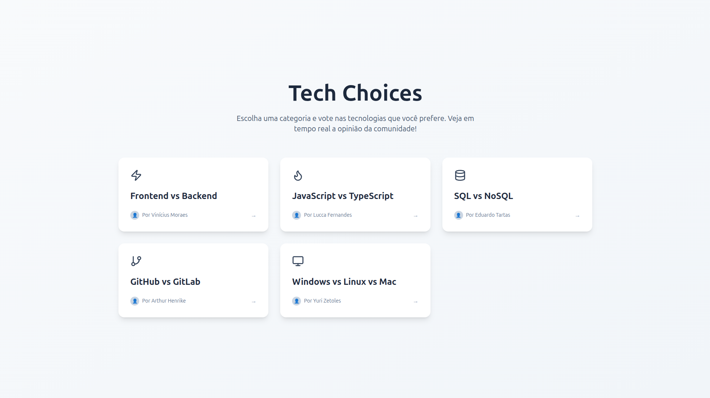

# 🚀 Tech Choices

Sistema de votação para escolhas tecnológicas com interface interativa e visualização de estatísticas em tempo real. 

Deploy: **[Tech Choices](https://tech-choices-front.vercel.app)**



## Tecnologias Utilizadas

### Frontend
- **Next.js** - Framework React com App Router
- **React** - Biblioteca de interface de usuário
- **TypeScript** - Tipagem estática
- **Tailwind CSS** - Framework CSS utilitário

### Backend
- **Node.js** - Runtime JavaScript
- **Express.js** - Framework web
- **MongoDB** - Banco de dados NoSQL
- **Mongoose** - ODM para MongoDB
- **Zod** - Validação de esquemas

## Deploy na Vercel

O projeto está configurado para deploy automático na Vercel tanto para o frontend quanto para o backend.

## Instalação

### Pré-requisitos
- Node.js
- MongoDB (local ou Atlas)

### Clonando o Repositório
```bash
git clone https://github.com/vximoraes/tech-choices.git
cd tech-choices
```

### Instalando Dependências

#### Backend
```bash
cd backend
npm install
```

#### Frontend
```bash
cd frontend
npm install
```

## Configuração

### Backend - Variáveis de Ambiente
Crie um arquivo `.env` na pasta `backend`:

```env
# Porta do servidor backend
PORT=3001

# URL de conexão com MongoDB (pode ser atlas)
MONGODB_URI=mongodb://localhost:27017/tech-choices

# Ambiente da aplicação
NODE_ENV=development
```

### Frontend - Variáveis de Ambiente
Crie um arquivo `.env.local` na pasta `frontend`:

```env
# URL da API backend
NEXT_PUBLIC_API_URL=http://localhost:3001
```

## Executando o Projeto

### Desenvolvimento

#### Backend
```bash
cd backend
npm run dev
# Servidor rodando em http://localhost:3001
```

#### Frontend
```bash
cd frontend
npm run dev
# Aplicação rodando em http://localhost:3000
```

### Produção

#### Backend
```bash
cd backend
npm start
```

#### Frontend
```bash
cd frontend
npm run build
npm start
```

## Estrutura do Projeto

```
tech-choices/
├── backend/
│   ├── src/
│   │   ├── api/
│   │   │   └── index.js           # Entrada principal da API
│   │   ├── config/
│   │   │   ├── categories.js      # Configuração das categorias
│   │   │   └── database.js        # Configuração do MongoDB
│   │   ├── controllers/           # Controladores das rotas
│   │   ├── models/
│   │   │   └── Vote.js            # Modelo de votação
│   │   ├── repositories/
│   │   │   └── VoteRepository.js  # Camada de acesso aos dados
│   │   ├── routes/                # Definição das rotas por categoria
│   │   └── services/
│   │       └── VoteService.js     # Lógica de negócio
│   ├── package.json
│   └── vercel.json               # Configuração para deploy
├── frontend/
│   ├── src/
│   │   ├── app/
│   │   │   ├── page.tsx          # Página principal
│   │   │   ├── layout.tsx        # Layout da aplicação
│   │   │   ├── frontBack/        # Página Frontend vs Backend
│   │   │   ├── jsTs/             # Página JavaScript vs TypeScript
│   │   │   ├── sqlNosql/         # Página SQL vs NoSQL
│   │   │   ├── githubGitlab/     # Página GitHub vs GitLab
│   │   │   └── windowsLinuxMac/  # Página Windows vs Linux vs Mac
│   │   ├── components/
│   │   │   ├── VoteStatsCard.tsx # Componente de estatísticas
│   │   │   └── ui/               # Componentes UI reutilizáveis
│   │   └── lib/
│   │       └── utils.ts          # Utilitários
│   ├── public/                   # Arquivos estáticos
│   └── package.json
└── README.md
```

## API Endpoints

### Categorias
- `GET /api/categories` - Listar todas as categorias disponíveis

### Votos por Categoria
- `GET /api/front-back` - Obter votos Frontend vs Backend
- `POST /api/front-back/vote` - Votar em Frontend vs Backend
- `GET /api/js-ts` - Obter votos JavaScript vs TypeScript
- `POST /api/js-ts/vote` - Votar em JavaScript vs TypeScript
- `GET /api/sql-nosql` - Obter votos SQL vs NoSQL
- `POST /api/sql-nosql/vote` - Votar em SQL vs NoSQL
- `GET /api/github-gitlab` - Obter votos GitHub vs GitLab
- `POST /api/github-gitlab/vote` - Votar em GitHub vs GitLab
- `GET /api/windows-linux-mac` - Obter votos Windows vs Linux vs Mac
- `POST /api/windows-linux-mac/vote` - Votar em Windows vs Linux vs Mac

## Categorias Disponíveis & Criadores

1. **Frontend vs Backend** 
    <br>

    <a href="https://github.com/vximoraes" target="_blank" rel="noopener noreferrer">
        
    </a>
    <br>
    <a href="https://github.com/vximoraes" target="_blank" rel="noopener noreferrer" style="vertical-align:middle;font-weight:700;color:inherit;text-decoration:none;">
        Vinicius Moraes
    </a>

    <br>

2. **JavaScript vs TypeScript**
   <br>

    <a href="https://github.com/Lucca-Livino" target="_blank" rel="noopener noreferrer">
        
    </a>
    <br>
    <a href="https://github.com/Lucca-Livino" target="_blank" rel="noopener noreferrer" style="vertical-align:middle;font-weight:700;color:inherit;text-decoration:none;">
        Lucca Fernandes
    </a>

    <br>

3. **SQL vs NoSQL** 
   <br>

    <a href="https://github.com/EduardoTartas" target="_blank" rel="noopener noreferrer">
        
    </a>
    <br>
    <a href="https://github.com/EduardoTartas" target="_blank" rel="noopener noreferrer" style="vertical-align:middle;font-weight:700;color:inherit;text-decoration:none;">
        Eduardo Tartas
    </a>

    <br>

4. **GitHub vs GitLab** 
   <br>

    <a href="https://github.com/ArthurGomes11" target="_blank" rel="noopener noreferrer">
        
    </a>
    <br>
    <a href="https://github.com/ArthurGomes11" target="_blank" rel="noopener noreferrer" style="vertical-align:middle;font-weight:700;color:inherit;text-decoration:none;">
        Arthur Henrike
    </a>

    <br>

5. **Windows vs Linux vs Mac** 
   <br>

    <a href="https://github.com/YuriZetoles" target="_blank" rel="noopener noreferrer">
        
    </a>
    <br>
    <a href="https://github.com/YuriZetoles" target="_blank" rel="noopener noreferrer" style="vertical-align:middle;font-weight:700;color:inherit;text-decoration:none;">
        Yuri Zetoles
    </a>

    <br>
